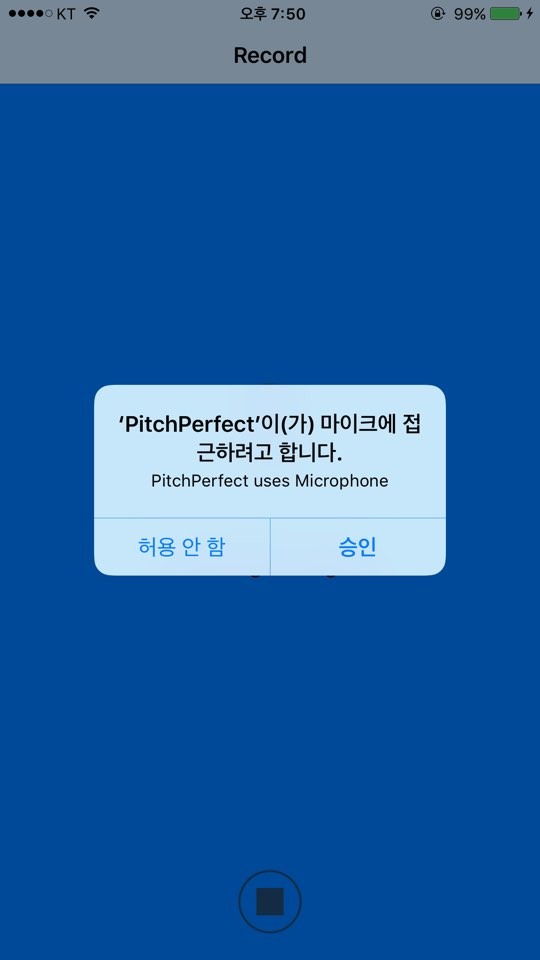
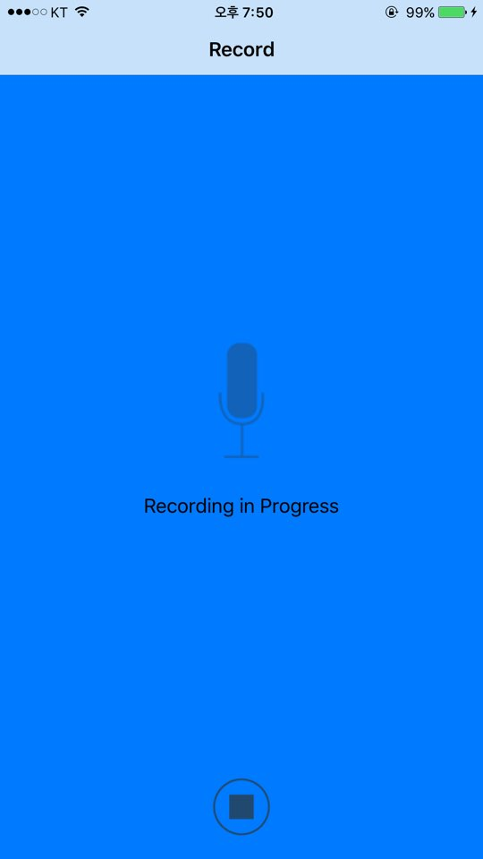
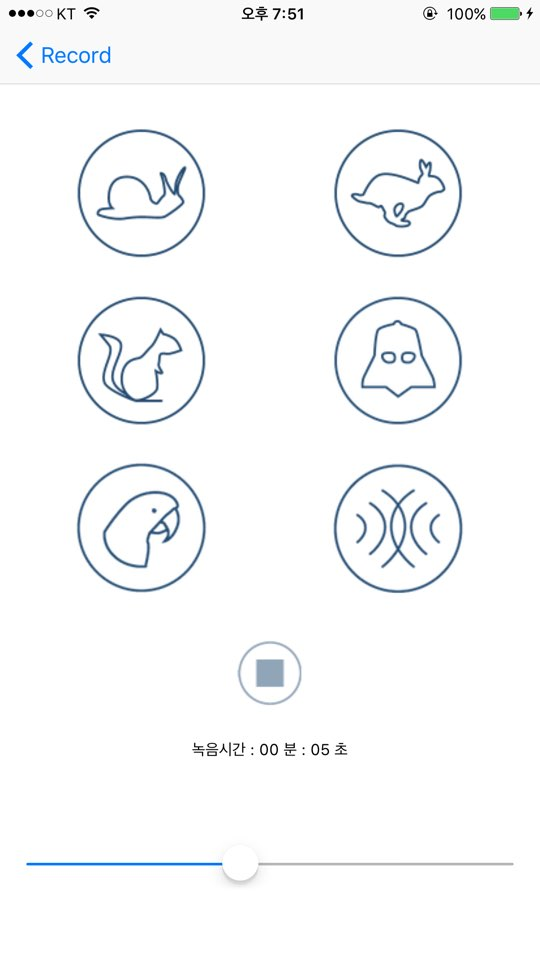
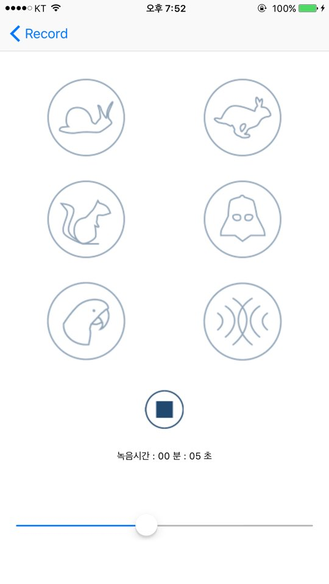

PitchPerfect  App
==================

**PitchPerfect by Zedd**
-------------

**PitchPerfect 앱 소개!**

> **Note:**

> -  직접 녹음을 하여 목소리를 변조할 수 있습니다. 
> -  총 6가지의 목소리 변조 기능.
> -  내가 녹음한 시간을 볼 수 있습니다. 
> -  또한 슬라이더를 이용해 볼륨을 조절 할 수 있습니다 .

> -

**kick**
--------

> - 볼륨을 슬라이더를 통해 조절합니다. 그냥 바로 녹음된 파일의 볼륨을 올리면 적용이 되지 않기 때문에, 버퍼를 이용해 녹음 파일을 버퍼안에 넣고 그 버퍼안의 볼륨을 조정하는 방식으로 구현.

**스크린샷**
----

> 앱을 처음 실행시키면 사용자에게 마이크 사용권한을 얻습니다.

> 마이크 버튼을 누르면 녹음을 진행하며 중지할 수 있는 버튼이 생깁니다.

> 이펙트가 적용되고 있지 않을 때에는 모든 사운드 이펙트 버튼들이 활성화가 되며 밑에는 내가 녹음한 시간과 볼륨조절을 할 수 있는 슬라이더가 있습니다.

> 이펙트가 적용되고 있을때는 다른 이펙트들을 누를 수 없으며 중지하는 버튼만 활성화가 됩니다.

**시연 동영상**
==========
따로 첨부하겠습니다. 

